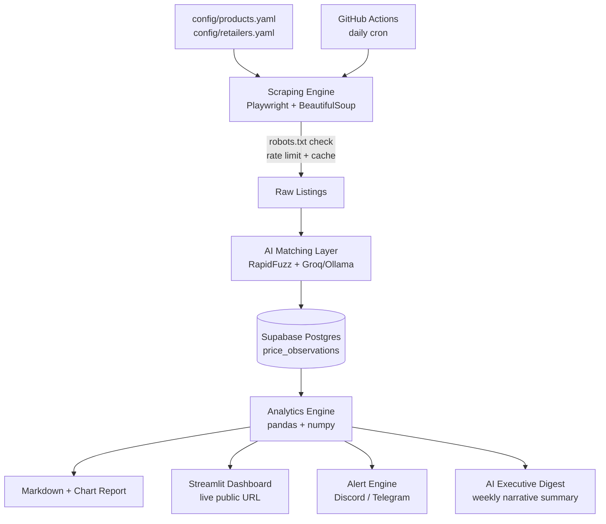

# PricePulse

### AI-assisted competitive price intelligence — built from a freelance brief into a live, multi-tenant platform, on $0/month infrastructure.

[](#) [](#) [](#)

**Live Demo:** 

## What is this?

PricePulse started as a freelance brief: scrape a handful of competitor sites, output a report showing who's cheapest. That version would have been useful for exactly one client, exactly once, under NDA.

This is the elevated version — an open-source, config-driven, AI-assisted competitive price intelligence platform. It resolves the actual hard problem in price comparison (matching "the same product" across retailers that all word their titles differently), tracks full price history in a real time-series database, and ships a live public dashboard instead of a static report — all on infrastructure that costs nothing to run.

## Features

- 🕸️ **Config-driven scraping** — add a product or a competitor via YAML, no code changes
- 🧠 **AI-assisted product matching** — RapidFuzz handles the easy cases; an LLM tiebreaker (Groq or local Ollama) resolves the rest, using chain-of-thought prompting and a parser hardened against hallucinated markdown formatting
- 📈 **Time-series price history** — every observation is a timestamped row in Postgres, so trend graphs and forecasting are a query away, not a rebuild
- 📊 **Live public dashboard** — Streamlit, auto-refreshing, filterable by product
- 🔔 **Automated alerts** — Discord/Telegram notifications when a competitor undercuts the market
- 🗓️ **Zero-infrastructure scheduling** — GitHub Actions daily cron, no server to patch or pay for
- 🤖 **AI executive digest** — weekly LLM-generated narrative summary of what moved and why
- 🏷️ **MAP compliance monitoring** — flags any retailer pricing below an agreed minimum
- ⚖️ **Composite "true value" scoring** — price + shipping + stock, not price in isolation
- 🔮 **Buy-now-or-wait forecasting** — a lightweight trend model, no heavyweight ML dependency
- 🔐 **Multi-tenant, auth-gated** — Supabase Auth + Row-Level Security, ready to serve more than one client from a single deployment

## Architecture



## Tech stack

| Layer | Tool | Why |
|---|---|---|
| Scraping | Playwright + BeautifulSoup | free, open-source headless browser automation |
| Compliance | robots.txt checker + rate limiter + cache | polite, responsible data collection by default |
| Matching | RapidFuzz + Groq / Ollama | fast fuzzy pass; LLM only for ambiguous cases, to stay inside free-tier limits |
| Database | Supabase (Postgres) | free tier, Row-Level Security, auto-generated REST API |
| Analytics | pandas, numpy | comparison logic, trend detection, lightweight forecasting |
| Dashboard | Streamlit (Community Cloud) | free hosting, live shareable URL |
| Alerts | Discord / Telegram webhooks | zero-cost push notifications |
| Orchestration | GitHub Actions | free, unattended daily scheduling |

## Quick start

```bash
git clone https://github.com/yourusername/pricepulse.git
cd pricepulse
python3 -m venv venv && source venv/bin/activate
pip install -r requirements.txt
playwright install chromium
cp .env.example .env   # fill in your Supabase/Groq/Discord keys
python -m pricepulse.main
```

Full setup, account creation, and deployment steps are in the [build guide](#).

## Adding a product

Open `config/products.yaml` and add an entry:

```yaml
sku: "YOURSKU"
display_name: "Product Name"
category: "category"
map_price: null
search_terms:
  - "search term"
```

Commit and push — the next scheduled run picks it up automatically. No code changes required.

## Adding or changing a competitor

1. Run the due-diligence checklist in `pricepulse/scraping/robots.py` docs against the target site (robots.txt, ToS, prefer an official API if one exists).
2. Copy an existing file in `pricepulse/scraping/adapters/` as a template and implement one method: `fetch(search_term) -> list[ScrapedListing]`.
3. Add one entry to `config/retailers.yaml` pointing `adapter_key` at your new class.

## Configuration

| Variable | Used by | Required |
|---|---|---|
| SUPABASE_URL | pipeline + dashboard | ✅ |
| SUPABASE_SERVICE_KEY | pipeline (write access) | ✅ |
| SUPABASE_ANON_KEY | dashboard (read-only) | ✅ |
| DISCORD_WEBHOOK_URL | alerts + weekly digest | optional |
| TELEGRAM_BOT_TOKEN / TELEGRAM_CHAT_ID | alerts (alternative) | optional |
| GROQ_API_KEY | AI matching + digest | optional (omit to use local Ollama instead) |

## Testing

```bash
pytest -v
```
